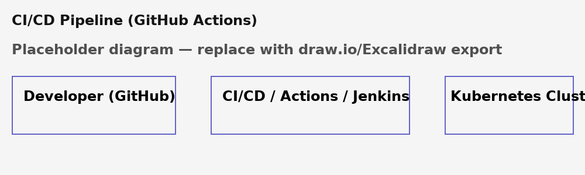

# CI/CD Pipeline (GitHub Actions)

**License:** MIT

## Overview
This repository is a ready-to-push scaffold demonstrating best practices for DevOps engineers.
It contains code, configs, and CI/CD examples to help you showcase skills to employers.

## What this repo includes
- Purpose and scope
- Sample configurations and workflows
- CI/CD examples and badges (placeholders)
- Diagrams (replace the PNG with your own design)

## Badges (placeholders)


## Architecture (quick ASCII diagram)
```
[Developer] --> [GitHub] --> [CI/CD] --> [Docker Registry] --> [Kubernetes Cluster]
```

## Diagram


## Prerequisites
- Git
- Docker
- Kubernetes cluster (minikube/kind/EKS/GKE/AKS)
- Terraform CLI (if applicable)
- Helm (for Helm charts)

## Setup & Usage (high-level)
1. Clone the repo:
   ```bash
   git clone https://github.com/yourusername/ci-cd-pipeline.git
   cd ci-cd-pipeline
   ```
2. Review README and update placeholders (image repos, secrets, bucket names).
3. For CI workflows: add required GitHub Secrets (DOCKERHUB_USERNAME, DOCKERHUB_TOKEN, KUBECONFIG, etc.).
4. Follow the project-specific README sections for deploy steps.

## Project-specific notes
- Replace all placeholder values (`yourrepo/*`, `your-terraform-state-bucket`, `https://github.com/YOUR-ORG/YOUR-REPO`, etc.).
- Do NOT commit credentials or private keys.

## Files of interest
- `.github/workflows/` — GitHub Actions workflows
- `Dockerfile` — build container images
- `helm-chart/` or `apps/` — Kubernetes manifests & Helm
- `main.tf`, `variables.tf` — Terraform (if present)

## Contributing
See CONTRIBUTING.md

## License
See LICENSE file for full terms.
